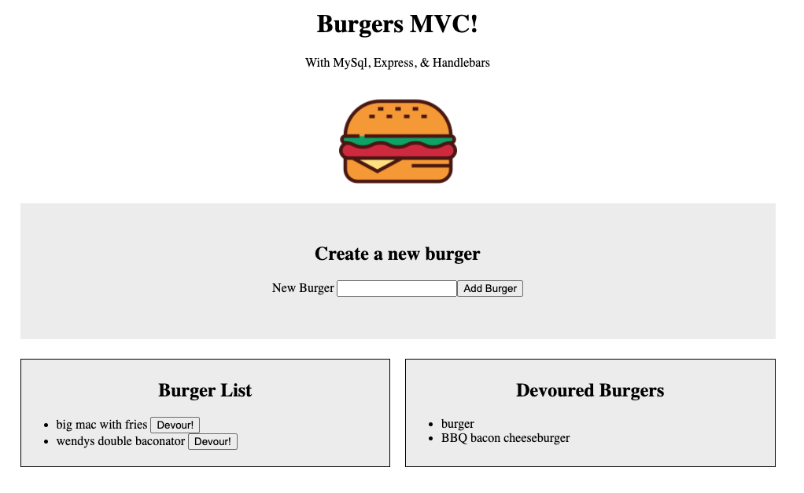

# MVC List Logger
 

## Live Application
https://young-dawn-56541.herokuapp.com/ 

## Creator
Matt Wieciech

#### Created On: 08/12/2020 

​ 

## Description
A full stack application that allows a user to create an item, in this case a burger, which is added to a list on the front end via express handlebars, then also added to a mysql database. The user than can choose to devour the burger, which will transfer the burger to the devoured list, and also update its status in the database. Built with an MVC design.  

## Table of Contents
* [Installation](#installation)
* [Usage](#usage)
* [License](#license)
* [Questions](#questions)

## Installation
1. This app is deployed to the web at https://young-dawn-56541.herokuapp.com/

## Usage
A user can create burges in the input field and devour them by clicking a button. Can also be used as a To Do list to create to do items and then check them off.

## License
This project is convered under the MIT License.

## Questions
For questions about this project, please see my GitHub at [wheaties5588](https://github.com/wheaties5588), or reach out by email at matt.wieciech@gmail.com.
